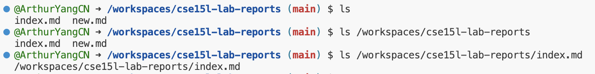
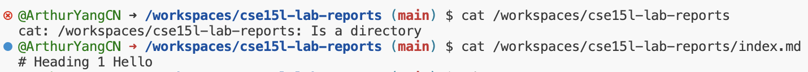

# Lab report 1:

# `cd` command:

Working Directory: `/workspaces/cse15l-lab-reports`

`cd` with no arguments: (Nothing behind the command)

Output: no output, but the working directory changes. It returns the user to the home directory '~'.

Working Directory: `/workspaces/cse15l-lab-reports`

`cd` With Directory Path:

Output: No direct output and nothing changes, because I am changing to the same directory path. So, I am still in the same directory.

Working Directory: `/workspaces/cse15l-lab-reports`

`cd` With File Path:

Output: Error, file path is not a directory.

# `ls` command:

Working Directory: `/workspaces/cse15l-lab-reports`
`ls` with no arguments: (Nothing behind the command)
Output: Files and directories listed.

Working Directory: `/workspaces/cse15l-lab-reports`
`ls` with Directory Path:
Output: Contents of the specified directory.

Working Directory: `/workspaces/cse15l-lab-reports`
`ls` with File Path:
Output: The file if it exists. Error, if the file doesn't exist.

# `cat` command:

Working Directory: `/workspaces/cse15l-lab-reports`
`cat` with no arguments: (Nothing behind the command)
Output: Waits for input. This is not an error. It enters a mode where it waits for input from the standard input

Working Directory: `/workspaces/cse15l-lab-reports`
`cat` with Directory Path:
Output: Error. This is because the argument is a directory, not a file. `cat` can take the file as the argument.

Working Directory: `/workspaces/cse15l-lab-reports`
`cat` with File Path:
Output: Contents of the file. This can shows Error, if the file doesn't exist in that path.

