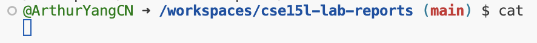

# Lab report 1:

# cd command:

Working Directory: /workspaces/cse15l-lab-reports
'cd' with no arguments. Nothing behind the command.
Output: no output, but the working directory changes. It returns the user to the home directory '~'.

Working Directory: /workspaces/cse15l-lab-reports
'cd' With Directory Path:
Output: No direct output and nothing changes.

Working Directory: /workspaces/cse15l-lab-reports
'cd' With File Path:
Output: Error, file path is not a directory.

# ls command:

Working Directory: /workspaces/cse15l-lab-reports
'ls' with no arguments. Nothing behind the command.
Output: Files and directories listed.

Working Directory: /workspaces/cse15l-lab-reports
'ls' with Directory Path:
Output: Contents of the specified directory.

Working Directory: /workspaces/cse15l-lab-reports
'ls' with File Path:
Output: The file if it exists. Error, if the file doesn't exist.

# cat command:

Working Directory: /workspaces/cse15l-lab-reports
'cat' with no arguments. Nothing behind the command.
Output: Waits for input.

Working Directory: /workspaces/cse15l-lab-reports
'ls' with Directory Path:
Output: Error, the argument is a directory, not a file.

Working Directory: /workspaces/cse15l-lab-reports
'ls' with File Path:
Output: Contents of the file. Error, if the file doesn't exist.

